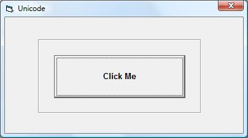



## A li'l Unicode

### Description

This is the result of playing with Unicode a little and it is by no means perfect, but as a beginning it may be helpful to some of you. Download is 2 kB. ~~ PS:- I speak none of the languages; I just picked some characters that looked typical too me.
 
### More Info
 

             |
---                |---
**Submitted On**   |2009-04-29 08:40:02
**By**             |[ULLI](https://github.com/Planet-Source-Code/PSCIndex/blob/master/ByAuthor/ulli.md)
**Level**          |Intermediate
**User Rating**    |5.0 (15 globes from 3 users)
**Compatibility**  |VB 6\.0
**Category**       |[Miscellaneous](https://github.com/Planet-Source-Code/PSCIndex/blob/master/ByCategory/miscellaneous__1-1.md)
**World**          |[Visual Basic](https://github.com/Planet-Source-Code/PSCIndex/blob/master/ByWorld/visual-basic.md)
**Archive File**   |[A\_li'l\_Uni2150994292009\.zip](https://github.com/Planet-Source-Code/ulli-a-li-l-unicode__1-72049/archive/master.zip)

